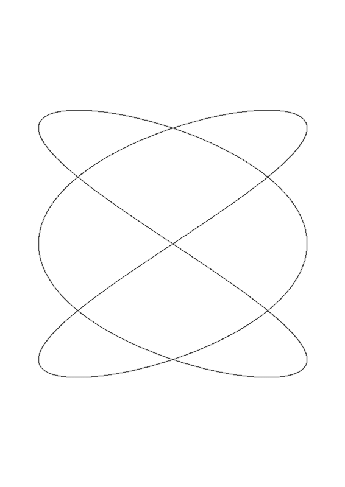
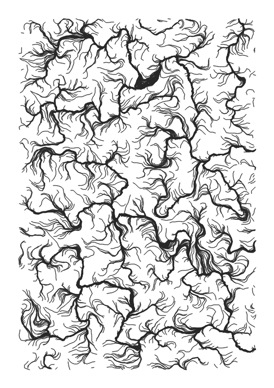
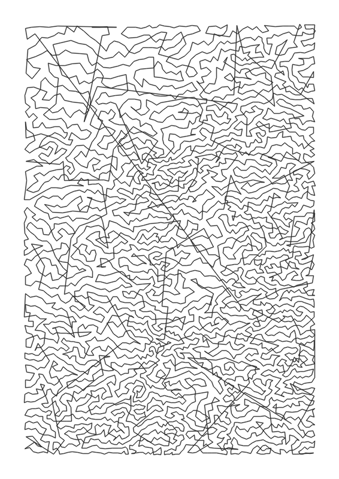
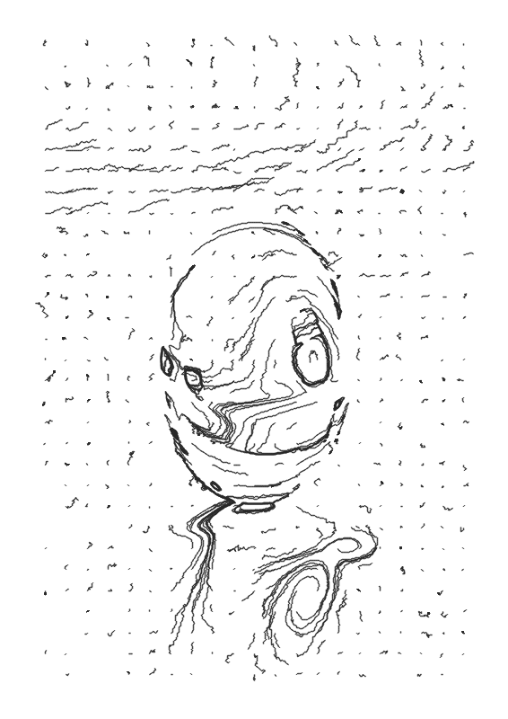
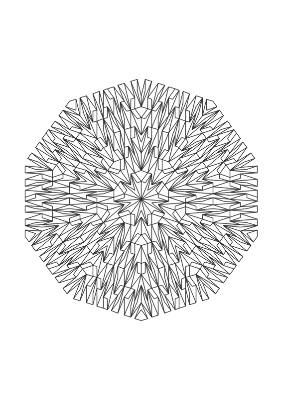
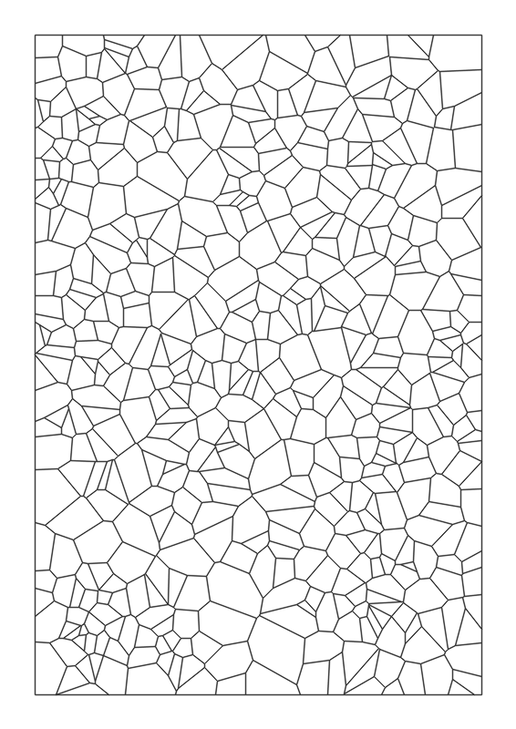
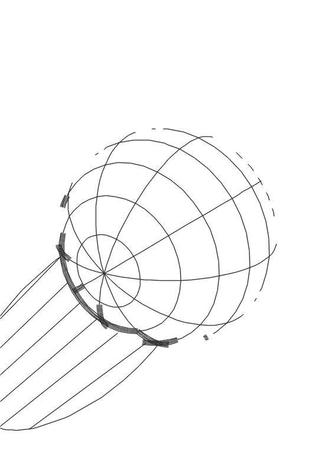

# Plottter

A free, open-source desktop application for generating pen-plotter-ready vector art from mathematical equations, generative algorithms, and raster images. Produces multi-layer output in SVG, HPGL, G-code, and Mural formats for any pen plotter.

## Features

**27 generators** across math art, image-to-lines, and 3D:

- **Math Art** — Parametric curves, polar curves, modular multiplication, Perlin noise flow fields, L-system fractals, grid patterns, Islamic geometric tiling, Celtic knots, concentric rings, dot grids, geometric grids, Voronoi/Delaunay tessellation, Penrose aperiodic tiling, calligraphy, and text rendering
- **Image to Lines** — Edge detection (Canny), hatching, flow field/squiggle, Voronoi stippling, contour lines, XDoG, FDoG (coherent lines), hedcut portraits, scanline halftone, circular scribble art, Line Integral Convolution (LIC), Tonal Art Maps (TAM), and dot grid halftone
- **3D Scene** — Wireframe renderer with hidden line removal, 10+ primitive shapes, OBJ/STL mesh import, camera controls, and shadow effects

**Multi-layer system** with per-layer pen colors, drag reorder, visibility/lock controls, and color separation (K-Means, Luminance, RGB, CMYK).

**Export formats:** SVG (mm coordinates), HPGL (vintage plotters), G-code (CNC/servo), Mural (wall-mounted plotters), and direct AxiDraw USB control.

**Post-processing tools:** Path optimization (KD-tree nearest-neighbor + 2-opt + Or-opt), simplification, merge, clip, weld overlapping paths, Bezier curve fitting, and a brush system (stippled, multi-stroke, calligraphic).

**Other features:** Stroke-order animation, pen-up travel visualization, pen jitter simulation, CLI batch mode, plugin system, Google Fonts integration, and AI-powered depth maps and background removal via Replicate.

## Gallery

| | | |
|---|---|---|
|  |  |  |
| Parametric Curves — Lissajous | Flow Field — Turbulent | Stipple — TSP Art |
|  |  |  |
| Hatching — Woodcut | Penrose Tiling — Classic P3 | Voronoi / Delaunay — Classic |
|  | | |
| 3D Scene — Dramatic Shadows | | |

## Requirements

| Requirement | Version |
|-------------|---------|
| Python | 3.12+ |
| OS | Linux, macOS, Windows |

## Installation

```bash
git clone https://github.com/pywkt/plottter.git
cd plottter

python -m venv .venv
source .venv/bin/activate  # Windows: .venv\Scripts\activate

pip install -e .
```

### Optional dependencies

```bash
pip install -e ".[fmm]"    # Fast Marching Method for topographic contours
pip install pyaxidraw       # Direct AxiDraw USB control
```

AI features (depth maps, background removal, segmentation) require a Replicate.com API key configured in Preferences.

## Usage

```bash
plottter           # Launch the GUI
python -m plottter # Alternative launch

# CLI batch mode
plottter --generator "Parametric Curves" --preset lissajous --output out.svg
plottter --list-generators  # Show all available generators
```

## Documentation

| Guide | Description |
|-------|-------------|
| [Getting Started](docs/getting-started.md) | Installation, first project, basic workflow |
| [Math Art Guide](docs/math-art-guide.md) | All math generators with parameters and presets |
| [Image-to-Lines Guide](docs/image-to-lines-guide.md) | 10 image conversion algorithms |
| [Layers & Colors](docs/layers-and-colors.md) | Multi-layer workflows and color separation |
| [Export & Plotting](docs/export-and-plotting.md) | SVG, HPGL, G-code, Mural export and AxiDraw control |
| [Preview & Simulation](docs/preview-and-simulation.md) | Animation, travel metrics, pen jitter |
| [Tips & Workflows](docs/tips-and-workflows.md) | Algorithm selection, optimization, brush effects, plugins |
| [Troubleshooting](docs/troubleshooting.md) | Common issues and fixes |

## License

MIT
